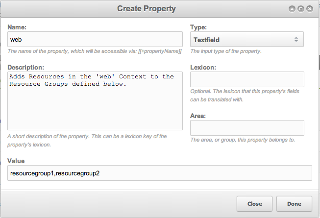

DefaultResourceGroups
=====================

###Use Case

You have a MODX site, and you're using Resource Groups to control editing and viewing of specific Resources. However, your site has a LOT of Resources. Will you define the Resource Group for each Resource manually? No! You will set DefaultResourceGroups (DRG) for each context, and watch the magic happen!

###Installation

Install via Package Management

###Basic Usage

DRG installs a Plugin that fires OnDocFormSave and OnResourceSort. The Plugin adds the Resource that is being saved or sorted into a default Resource Group. You can define default Resource Groups for Resources in each Context, by adding custom properties to the Plugin (go to the Plugin Edit view and select the "Properties" tab). 

The "Name" of the property should be the Context key, and the "Value" of the property should be a comma-separated list of Resource Groups in which to place Resources, if they are in the specified Context.

An included property, 'preserveGroups' controls the behaviour of the plugin in regards to Resources that already belong to Resource Groups specified in the Plugin properties.

